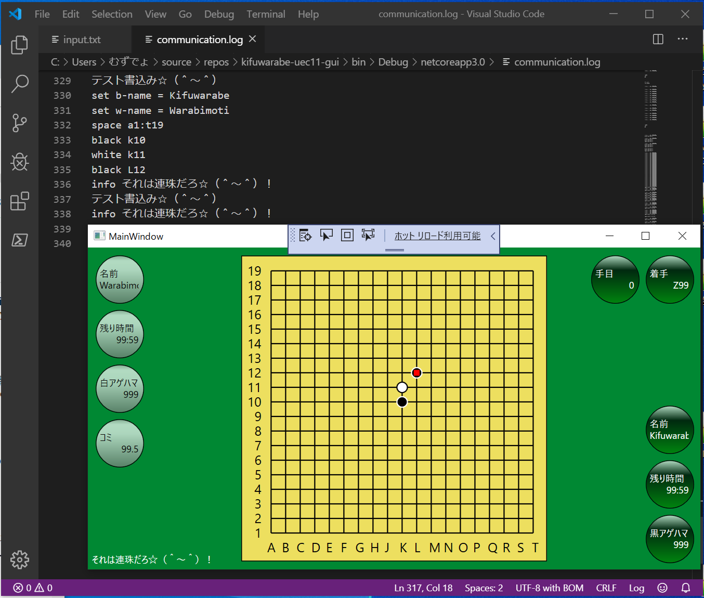

# kifuwarabe-go-board-gui
手抜きの囲碁盤のＧＵＩ☆（＾～＾）　思考部は含まれていないので安心してダウンロードしろだぜ☆（＾～＾）

  


# Script API

```
# えっ、お前らまだ　コンピューター囲碁プログラミング始めないの☆（＾ｑ＾）？
set info.type = string
info こんなに便利な GUI がフリーなのに☆（＾～＾）！？
```

[Script API](./doc/script-api.md)

# Example script

* アニメ画像ファイル作るなら [ScreenToGif](https://www.screentogif.com/)
*   [Example-1 Horizon](./doc/example-script/script-1.txt)
*   [Example-2 Star-Foreground](./doc/example-script/script-2.txt)
*   [Example-3 Star-Background](./doc/example-script/script-3.txt)
*   [Example-4 Star-Background-Colored](./doc/example-script/script-4.txt)

# Output JSON

コマンドを全部 GUI が処理すると最後に `./output.json` を出力する☆（＾～＾） 仕様は 決まってないぜ☆（＾～＾）実装の気分☆（＾～＾）

[Sample](./doc/sample/output.json)


# Application object model

データの互換フォーマットの仕様だぜ☆（＾～＾）

[Standard-application object model](./doc/standard-application-object-model.md)
