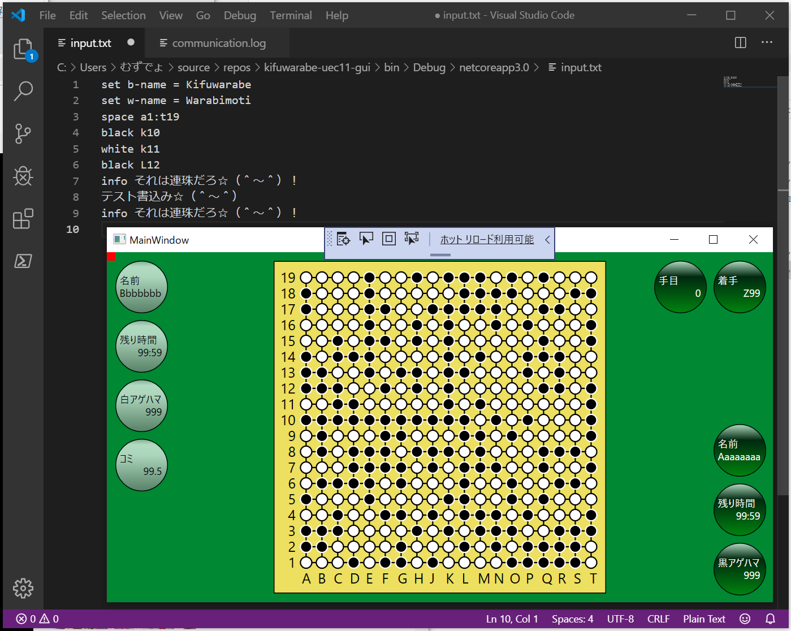
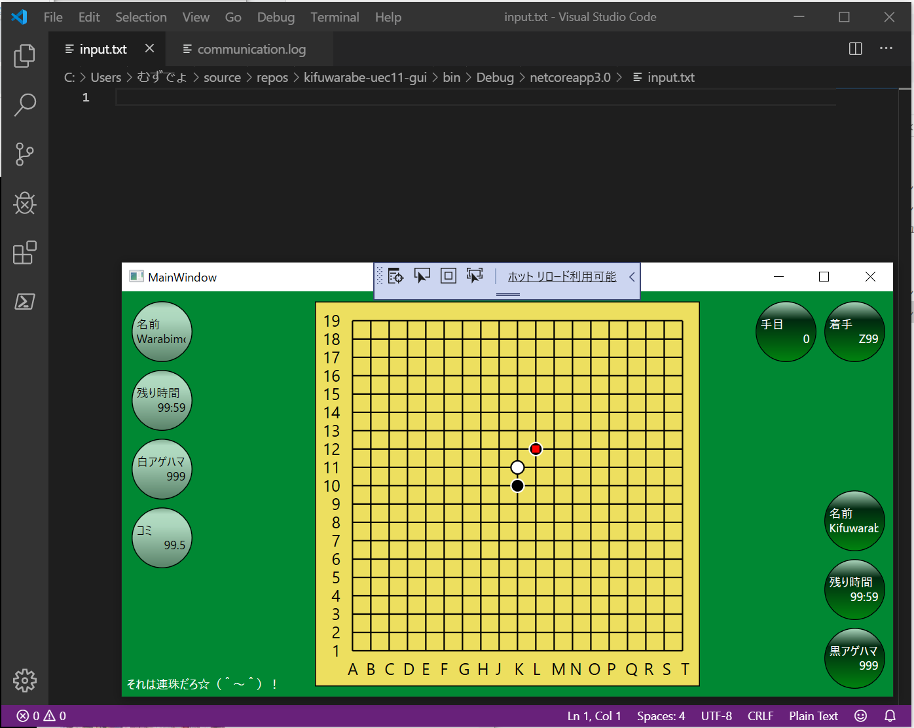

# Script API


このプログラムは何を書いているのか……という顔をしているお前らのために。


# テキスト・ファイル通信という謎のシステム☆（＾～＾）

  
↑  

1. Visual studio code を使って `./input.txt` ファイルを開けだぜ☆（＾～＾） ファイルをロックせず、ファイルの内容がリアルタイムに反映される優れものだぜ☆（＾～＾）
2. お前は input.txt に何かテキストを打ち込むといいだろう☆（＾～＾）　そして [Ctrl]+[S]キーでも使ってファイルを保存したら　キーボードから手を放せだぜ☆（＾～＾） 触んな☆ｍ９（＾～＾） 
3. `kifuwarabe-uec11-gui.exe` は 2秒間隔ぐらいで `./input.txt` ファイルを ファイルをロックせずに覗き見にくるぜ☆（＾～＾）

  
↑  

4. `kifuwarabe-uec11-gui.exe` は input.txt ファイルの内容が が空でなければ 消す☆（＾～＾） そのときテキストは複数行コマンド（スクリプト）として読み込むぜ☆（＾～＾）
5. お前は Visual studio code で `input.txt` ファイルの中身が消えたことに顔色を真っ青にしながら　つぎのテキストを打てだぜ☆（＾～＾）
6. `kifuwarabe-uec11-gui.exe` は input.txt を消しもするが `communication.log` にも書き出している☆（＾～＾）　調子乗って長文書いたら１つのファイルが膨れ上がるからな☆ｍ９（＾～＾）


# 行頭 `#` はコメント


Example:


```
#banana
# banana
## banana
 #banana
 # banana
 ```


 # 名前=値 になってるのを設定するのは `set`


Example:


```
set name = value
```


|name|type|description|
|----|----|-----------|
|ply|int|何手目か☆（＾～＾）|
|move|CellAddress|最後の着手☆（＾～＾） `A1` とか入れろだぜ☆（＾～＾）|
|b-name|string|黒番の氏名☆（＾～＾）|
|b-time|string|黒番の持ち時間☆（＾～＾）飾り☆（＾～＾）<br/>とりあえず `23:59` みたいな書式で入れとけだぜ☆（＾～＾）|
|b-hama|int|黒番のアゲハマ☆（＾～＾）取り揚げた白石の数だぜ☆（＾～＾）<br/>日本ルールだけ使う☆（＾～＾）<br/>白石はハマグリで出来てるのが由来でハマといえば石のことだぜ☆（＾～＾）|
|w-name|string|白番の氏名☆（＾～＾）|
|w-time|string|白番の持ち時間☆（＾～＾）|
|w-hama|int|白番のアゲハマ☆（＾～＾）|
|komi|double|コミ☆（＾～＾）<br/>囲碁は先手黒番有理なんで、白にあげるハンディキャップだぜ☆（＾～＾）<br/>昭和初期まで戦後２番打ってたが、１番で済ませたくなって<br/>互先（たがいせん）ルールが作られて使われ始めた☆（＾～＾）<br/>コミがいくつかはプロの公式戦の戦後の勝率を見て稀に更新されている☆<br/>えっ、話しが長いだって☆（＾～＾）？お前が黙ってろだぜ☆（＾～＾）|
|info|int|GUIの画面上にちょこっと文字を表示する、とって付けたような機能☆（＾～＾）<br/>勝率とか勝敗はこれで描けだぜ☆（＾～＾）<br/>`\n` で改行、 `\\` は \。<br/>それ以外のエスケープ文字は全部無効☆（＾～＾）||


# 盤に石を置くなら `space`、 `black`、 `white` を使いこなせだぜ☆（＾～＾）


Example:


```
# 1個
black H1
white J10
space T19

# 複数個
black A1 B2 C3 D4

# 矩形塗りつぶし
black A1:C3

# 混合
white A1 B2:D4 E5 F6:H8
```

お絵描きができるな☆（＾～＾）

