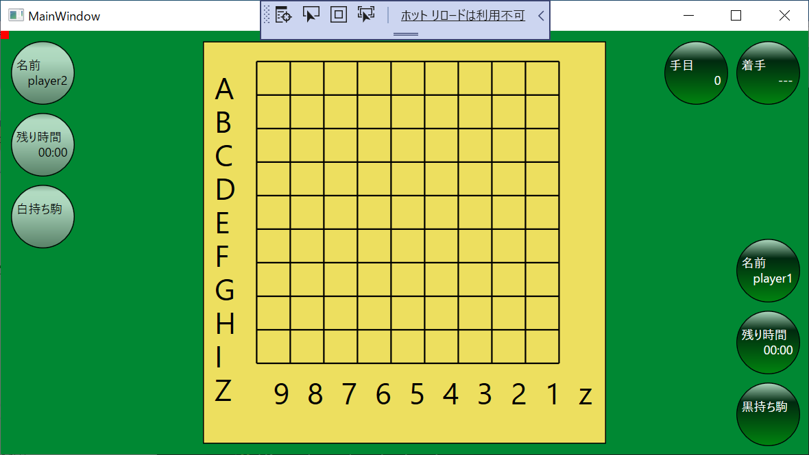

# WIP. Shogi extend

WIP. 将棋にも対応できるように拡張しようぜ☆（＾～＾）



```
# script☆（＾～＾）
#----------------------------------------
# 盤設定☆（＾～＾）

# 将棋はマスに駒を置くぜ☆（＾～＾）
# 値を set する前に new で名前と型を決めろだぜ☆（＾～＾）
new piece-location : string
set piece-location = square

# このソフトは碁盤なんで、線の本数を指定しろだぜ☆（＾～＾）
new row-size : number
set row-size = 10

set column-type = number
set column-size = 10

# 列番号☆（＾～＾）
new column-numbers : string-list
set column-numbers = "9", "8", "7", "6", "5", "4", "3", "2", "1", "z"

# 特殊：　行番号だけ、右寄せの代わりに　前スペースを入れていい☆（＾～＾）
# 入力時のキータイピングにも使う☆（＾～＾） USI に合わせとけだぜ☆（＾～＾）
new row-numbers : string-list
set row-numbers = "  A", "  B", "  C", "  D", "  E", "  F", "  G", "  H", "  I", "  Z"

# 盤上の星☆（＾～＾） あくまで符号は線を指している☆（＾～＾） ややこしい☆（＾～＾）
# TODO でも表示されてないな☆（＾～＾）　なんでだろな☆（＾～＾）
new stars : string-list
set stars = "D6", "G6", "D3", "G3"

#----------------------------------------
# UIの本名（左）に、自作の変数名（右）を紐づけろだぜ☆（＾～＾）
alias top1 = move
alias top2 = ply
alias right1 = b-hand
alias right2 = b-time
alias right3 = b-name
alias left1 = w-name
alias left2 = w-time
alias left3 = w-hand

# 読み筋とか表示したいときに使うやつ☆（＾～＾）
new info : string
set info =

# 指し手の符号を表示するやつ☆（＾～＾）
new move : string
set move.title = 着手
set move       = ---

# 何手目かを表示するやつ☆（＾～＾）
new ply : number
set ply.title = 手目
set ply       = 0

# プレイヤー１の名前を表示するやつ☆（＾～＾）
new b-name : string
set b-name.title = 名前
set b-name       = player1

# プレイヤー１の残り時間を表示するやつ☆（＾～＾）
new b-time : string
set b-time.title = 残り時間
set b-time       = 00:00

# プレイヤー１のアゲハマを表示するやつ☆（＾～＾）
new b-hand : string
set b-hand.title = 黒持ち駒
set b-hand       = 

# プレイヤー２の名前を表示するやつ☆（＾～＾）
new w-name : string
set w-name.title = 名前
set w-name       = player2

# プレイヤー２の残り時間を表示するやつ☆（＾～＾）
new w-time : string
set w-time.title = 残り時間
set w-time       = 00:00

# プレイヤー２のアゲハマを表示するやつ☆（＾～＾）
new w-hand : string
set w-hand.title = 白持ち駒
set w-hand       = 

# WIP
# new move-marker : string
# set move-marker         = A1
# set move-marker.visible = false

# 盤の初期配置☆（＾～＾） 行番号を決めたあとにしろだぜ☆（＾～＾）
# あくまで符号は線を指している☆（＾～＾） ややこしい☆（＾～＾）
board A wwwwwwwww.
board B .w.....w..
board C wwwwwwwww.
board D ..........
board E ..........
board F ..........
board G bbbbbbbbb.
board H .b.....b..
board I bbbbbbbbb.
board Z ..........
#       987654321z
```
